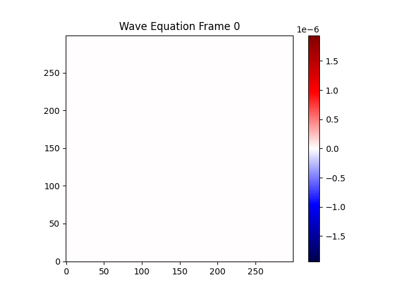
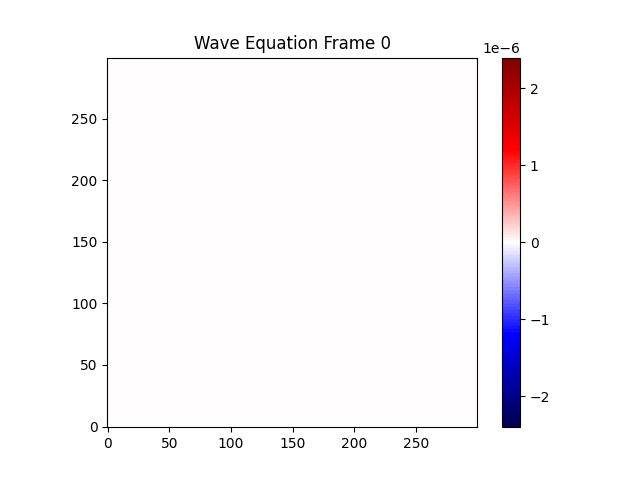
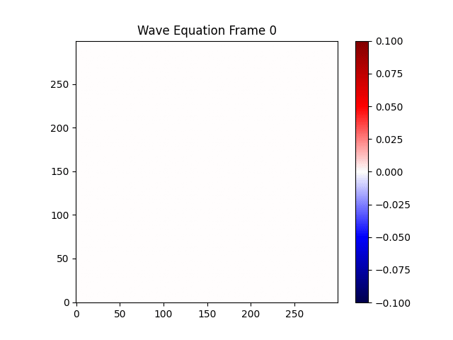

# Wave Equation Lab (Python vs C)

Welcome to the **Wave Equation Lab**, a computational sandbox designed to explore the physics of wave propagation, PDE discretization, numerical stability, and the performance differences between high-level interpreted code (Python/NumPy) and low-level system code (C).

---

## Experiments Gallery Showcase

Below are example outputs produced from the JSON configs in `shared/configs`. Read `EXPERIMENTATION_GUIDE.md` for deeper parameter tuning and experiment workflows.

### default.json
Baseline homogeneous medium with $c=3.0$, Gaussian initial condition, and no external forcing.


---

### linear_media_change.json
Piecewise medium with a vertical interface at $x=0.4$ (`media_type=1`): left side $c=4.0$, right side $c_{alt}=1.0$, driven by a Ricker source ($f=30.0$).


---

### lens.json
Circular lens medium (`media_type=2`) centered at $(0.5, 0.5)$ with radius $0.1$, combining $c=4.0$ outside and $c_{alt}=1.0$ inside under Ricker forcing.


---

### init_gaussian.json
Gaussian initial displacement in a uniform medium ($c=3.0$), useful for observing clean radial propagation from an initial state.


---

### init_impulse.json
Point-impulse initial condition in a uniform medium ($c=3.0$), emphasizing high-frequency content from a localized kick.


---

### forcing_ricker.json
No prescribed initial field; wave energy is injected over time using a Ricker forcing term with $f=30.0$ in a homogeneous medium.


---

### forcing_sine.json
Time-harmonic forcing experiment using a sinusoidal source ($f=20.0$) in a homogeneous medium ($c=3.0$).


---

### forcing_chirp.json
Frequency-sweep forcing from $f_0=5.0$ to $f_1=50.0$ over $t_1=1.0$, highlighting broadband response in the same grid.


---

### break_clf_condition.json
Deliberately aggressive setup ($c=4.8$, $\Delta t=0.0005$, $\Delta x=\Delta y=0.00333333$) that violates the 2D CFL threshold and demonstrates numerical blow-up.


---

### damping_absorbing_boundary.json
Ricker-forced with baseline attenuation and a smooth high-damping edge layer, reducing reflections from the fixed domain boundaries.


---

## 1. Project Vision & Architecture

This laboratory serves three core purposes:
1. **Mathematical & Physical Intuition**: Connecting continuous differential equations to discrete computational updates.
2. **Numerical Method Exploration**: Exploring concepts like finite differences, numerical stability (CFL condition), and grid dispersion.
3. **Software Architecture & Optimization**: Benchmarking high-level vectorized matrix operations against contiguous raw-memory C pointers.

```
wave-equation/
│
├── README.md
├── EXPERIMENTATION_GUIDE.md
├── Makefile
├── c/
│   ├── include/
│   │   ├── cJSON.h
│   │   └── wave.h
│   └── src/
│       ├── cJSON.c
│       ├── io.c
│       ├── main.c
│       └── wave_2d.c
├── python/
│   ├── .python-version
│   ├── pyproject.toml
│   ├── main.py
│   └── src/
│       └── wave/
│           ├── solver_2d.py
│           └── visualization.py
├── shared/
│   ├── configs/
│   │   ├── default.json
│   │   ├── linear_media_change.json
│   │   ├── lens.json
│   │   ├── init_gaussian.json
│   │   ├── init_impulse.json
│   │   ├── forcing_ricker.json
│   │   ├── forcing_sine.json
│   │   ├── forcing_chirp.json
│   │   └── break_clf_condition.json
│   └── data/
└── output/
```

---

## 2. Mathematical Foundation & Continuous Wave Equation

The continuous wave equation is a second-order hyperbolic partial differential equation (PDE) describing how waves propagate through a medium.

### 2.1 The 1D Wave Equation
$$
\frac{\partial^2 u}{\partial t^2} = c^2 \frac{\partial^2 u}{\partial x^2}
$$

### 2.2 The 2D Wave Equation
$$
\frac{\partial^2 u}{\partial t^2} = c^2 \left( \frac{\partial^2 u}{\partial x^2} + \frac{\partial^2 u}{\partial y^2} \right) = c^2 \nabla^2 u
$$

Where:
- $u(x, y, t)$ is the wave displacement (e.g., height of water ripples, acoustic pressure).
- $c$ is the wave speed in the medium.
- $\frac{\partial^2 u}{\partial t^2}$ represents the **temporal acceleration**.
- $\nabla^2 u$ (the Laplacian) represents the **spatial curvature**.

### Attenuating Media
To model energy loss in air, walls, or geological material, the solver also supports spatial damping:
$$
\frac{\partial^2 u}{\partial t^2} + \gamma(x,y)\frac{\partial u}{\partial t} = c(x,y)^2\nabla^2u.
$$
Set a uniform baseline with `"damping": 0.01`, then optionally use a `damping_profile` for split regions, circular material, or smooth absorbing boundary layers. See [PARAMETERS.md](PARAMETERS.md) for the full configuration schema.

---

### 2.3 Physical Derivation (Newtonian Stretched String)

To build physical intuition, we derive the 1D wave equation from Newton's Second Law applied to a tiny segment of a stretched string:

#### Physical Setup:
- A perfectly flexible, stretched string with constant mass density $\rho$ (mass per unit length).
- Tension $T$ pulling tangentially along the string.
- Vertical displacement $u(x, t)$ along the horizontal coordinate $x$.
- We isolate a tiny segment of the string between $x$ and $x + \Delta x$.

#### Assumptions:
1. Small displacements: The slopes $\frac{\partial u}{\partial x}$ are small, meaning angles $\theta$ made with the horizontal are small.
2. Constant tension: The tension $T$ is uniform throughout the segment.
3. Strictly vertical motion: Horizontal displacements are negligible.

#### Force Balance:
At each end of the segment, the tension $T$ acts tangentially:
- The left end angle is $\theta(x)$.
- The right end angle is $\theta(x + \Delta x)$.

The net vertical force $F_y$ on the segment is:
$$
F_y = T \sin\theta(x + \Delta x) - T \sin\theta(x)
$$

For small angles, we use the small-angle approximation $\sin\theta \approx \tan\theta \approx \frac{\partial u}{\partial x}$:
$$
F_y \approx T \left[ \frac{\partial u}{\partial x}\bigg|_{x + \Delta x} - \frac{\partial u}{\partial x}\bigg|_x \right]
$$

Dividing and multiplying by $\Delta x$ yields:
$$
F_y \approx T \Delta x \left[ \frac{\frac{\partial u}{\partial x}\big|_{x + \Delta x} - \frac{\partial u}{\partial x}\big|_x}{\Delta x} \right] \approx T \frac{\partial^2 u}{\partial x^2} \Delta x
$$

#### Newton's Second Law:
The mass of our small string segment is $m = \rho \Delta x$. Its vertical acceleration is $a_y = \frac{\partial^2 u}{\partial t^2}$. Applying $F = ma$:
$$
T \frac{\partial^2 u}{\partial x^2} \Delta x = (\rho \Delta x) \frac{\partial^2 u}{\partial t^2}
$$

Canceling $\Delta x$ gives:
$$
T \frac{\partial^2 u}{\partial x^2} = \rho \frac{\partial^2 u}{\partial t^2} \implies \frac{\partial^2 u}{\partial t^2} = \left(\frac{T}{\rho}\right) \frac{\partial^2 u}{\partial x^2}
$$

Defining the wave speed $c^2 = \frac{T}{\rho}$, we arrive at the classic 1D wave equation:
$$
\frac{\partial^2 u}{\partial t^2} = c^2 \frac{\partial^2 u}{\partial x^2}
$$

> **Deep Intuition**: The equation states that **local acceleration is proportional to local curvature**. If a portion of the string is curved, it feels a restoring force pulling it back towards flatness, causing oscillatory motion that propagates as a wave.

---

### 2.4 Alternative Viewpoint: Energy Conservation

The wave equation can also be derived by minimizing total energy using the principle of least action (Hamilton's Principle).
- **Kinetic Energy Density**: $\mathcal{T} = \frac{1}{2} \rho \left( \frac{\partial u}{\partial t} \right)^2$
- **Potential Energy Density** (due to elastic stretching): $\mathcal{V} = \frac{1}{2} T \left( \frac{\partial u}{\partial x} \right)^2$

The total energy $E$ in the system is conserved:
$$
E = \int \left[ \frac{1}{2} \rho \left(\frac{\partial u}{\partial t}\right)^2 + \frac{1}{2} T \left(\frac{\partial u}{\partial x}\right)^2 \right] dx
$$

In a discrete system, tracking this energy is a critical diagnostic: if the total energy grows over time, the numerical scheme is unstable.

---

## 3. Mathematical Analysis: The Fourier Domain & Dispersion

To understand how waves propagate and why numerical methods sometimes distort them, we analyze the wave equation in frequency space.

### 3.1 Fourier Transform in Space
Taking the spatial Fourier transform of $u(x, t)$:
$$
\hat{u}(k, t) = \int_{-\infty}^{\infty} u(x, t) e^{-i k x} dx
$$
The spatial derivative maps to multiplication:
$$
\frac{\partial^2 u}{\partial x^2} \longrightarrow -k^2 \hat{u}(k, t)
$$
Substituting this into the wave equation converts our PDE into a family of decoupled ordinary differential equations (ODEs), one for each wavenumber $k$:
$$
\frac{d^2 \hat{u}}{dt^2} + c^2 k^2 \hat{u} = 0
$$

This is a simple harmonic oscillator. The analytical solution for each frequency mode is:
$$
\hat{u}(k, t) = A(k) \cos(c k t) + B(k) \sin(c k t)
$$

### 3.2 Analytical Dispersion Relation
The angular frequency $\omega$ of these oscillations is:
$$
\omega(k) = c k
$$
This linear relationship is the **dispersion relation**. Since the phase velocity $v_p = \frac{\omega}{k} = c$ is constant and independent of the wavenumber $k$, all wave packets propagate at the exact same speed $c$. The wave is **non-dispersive** (it does not distort as it travels).

---

### 3.3 Numerical Dispersion (Grid Distortion)
When we replace the continuous spatial derivative with a discrete finite difference approximation:
$$
\frac{\partial^2 u}{\partial x^2} \approx \frac{u_{i+1} - 2u_i + u_{i-1}}{\Delta x^2}
$$
And evaluate it using a discrete Fourier mode $u_i = e^{i k x_i}$ where $x_i = i \Delta x$:
$$
\frac{e^{i k (i+1)\Delta x} - 2e^{i k i \Delta x} + e^{i k (i-1)\Delta x}}{\Delta x^2} = e^{i k x_i} \left[ \frac{e^{i k \Delta x} - 2 + e^{-i k \Delta x}}{\Delta x^2} \right] = e^{i k x_i} \left[ \frac{2\cos(k\Delta x) - 2}{\Delta x^2} \right]
$$
Thus, the discrete grid replaces the continuous wavenumber $k^2$ with an **effective wavenumber** $k_{\text{effective}}^2$:
$$
k_{\text{effective}}^2 = \frac{2(1 - \cos(k\Delta x))}{\Delta x^2}
$$

#### Implications:
- **Low frequencies (small $k$)**: $\cos(k\Delta x) \approx 1 - \frac{(k\Delta x)^2}{2}$, so $k_{\text{effective}}^2 \approx k^2$. Smooth waves propagate accurately.
- **High frequencies (large $k$)**: The effective wavenumber curves downward, meaning high-frequency oscillations propagate **slower** than the physical wave speed $c$. This causes wave packets with sharp edges to "disperse" or trail high-frequency ripples over time.

---

## 4. Discretization & Numerical Schemes (FDM)

We solve the continuous wave equation using the **Finite Difference Method** on a structured grid in space and time.

### 4.1 Comparison of Numerical Methods
Before deciding on FDM, we evaluated different discretization strategies:
- **Finite Difference Method (FDM)** (Used here): Replaces derivatives with local difference formulas on structured grids. Extremely fast and easy to vectorize, but difficult to apply to highly irregular shapes.
- **Finite Element Method (FEM)**: Dissects the space into triangles or quads, solving a integral weak formulation. Handles complex geometric boundaries perfectly but requires mesh generation and solving large systems of equations.
- **Finite Volume Method (FVM)**: Approximates integrals over small cell volumes. Excellent for conservation laws (fluids, shocks), but mathematically complex for second-order wave equations.

---

### 4.2 The Grid & Index Mapping
We discretize space and time as:
- Space (2D): $x_i = i\Delta x$ ($i \in [0, N_x-1]$), $y_j = j\Delta y$ ($j \in [0, N_y-1]$)
- Time: $t^n = n\Delta t$ ($n \in [0, N_t-1]$)

#### Flat Memory Access (C Row-Major Convention):
In Python, matrices are accessed using 2D slicing syntax. In C, multidimensional arrays are allocated as a flat 1D array to keep memory contiguous and optimize cache efficiency. We map the index `(i, j)` using:
$$
\text{index} = i \cdot N_y + j
$$

---

### 4.3 Second Derivative Approximation
Using Taylor series expansions, the second derivatives are approximated using central differences:
$$
\frac{\partial^2 u}{\partial t^2} \approx \frac{u^{n+1} - 2u^n + u^{n-1}}{\Delta t^2}
$$
$$
\frac{\partial^2 u}{\partial x^2} \approx \frac{u_{i+1,j}^n - 2u_{i,j}^n + u_{i-1,j}^n}{\Delta x^2}
$$
$$
\frac{\partial^2 u}{\partial y^2} \approx \frac{u_{i,j+1}^n - 2u_{i,j}^n + u_{i,j-1}^n}{\Delta y^2}
$$

---

### 4.4 The 2D Explicit Update Rule
By substituting the second derivative approximations into the 2D continuous wave equation and solving for the future value $u^{n+1}$:
$$
u_{i,j}^{n+1} = 2u_{i,j}^n - u_{i,j}^{n-1} + \lambda_x^2 \left( u_{i+1,j}^n - 2u_{i,j}^n + u_{i-1,j}^n \right) + \lambda_y^2 \left( u_{i,j+1}^n - 2u_{i,j}^n + u_{i,j-1}^n \right)
$$

Where the dimensionless Courant numbers are defined as:
$$
\lambda_x = \frac{c \Delta t}{\Delta x}, \quad \lambda_y = \frac{c \Delta t}{\Delta y}
$$

---

### 4.5 Memory Optimization: Pointer Swapping
Instead of storing all time steps ($O(N_t N_x N_y)$ memory), which quickly consumes gigabytes of RAM, we only maintain three discrete states at any time step $n$:
- `u_prev` ($u^{n-1}$): The past state.
- `u_curr` ($u^{n}$): The current state.
- `u_next` ($u^{n+1}$): The future state (computed by the update rule).

Once the updates are calculated for the entire grid, we swap the pointers:
```python
# Rotate states (Python pointer swap)
u_prev, u_curr, u_next = u_curr, u_next, u_prev
```
In C, this is done with identical low-overhead pointer swaps:
```c
double *temp = u_prev;
u_prev = u_curr;
u_curr = u_next;
u_next = temp;
```
This reduces memory consumption to a tiny, constant $O(N_x N_y)$ footprint.

---

## 5. Numerical Stability & The CFL Condition

Discretizing PDEs comes with a massive danger: **numerical instability**. If the timestep $\Delta t$ is too large relative to the grid spacing $\Delta x$ and wave speed $c$, numerical errors accumulate exponentially, causing the system to blow up to infinity.

### 5.1 The Courant-Friedrichs-Lewy (CFL) Condition

For an explicit finite-difference scheme, the numerical domain of dependence must contain the physical domain of dependence.

#### 1D Scheme Stability:
$$
\lambda = \frac{c \Delta t}{\Delta x} \leq 1
$$

#### 2D Scheme Stability:
$$
\lambda_x^2 + \lambda_y^2 \leq 1
$$
If $\Delta x = \Delta y$:
$$
\frac{c \Delta t}{\Delta x} \leq \frac{1}{\sqrt{2}} \approx 0.707
$$

#### Physical Intuition:
If $\lambda > 1$ (or $1/\sqrt{2}$ in 2D), the physical wave speed is traveling faster than the maximum speed at which information can propagate across the numerical grid cells (one cell per timestep). The simulation cannot capture the physics, leading to immediate exponential instability (blow-up).

---

## 6. Lab Sandbox & Performance Benchmarking

One of the highlights of this lab is comparing high-level vectorized Python code (NumPy) against explicit low-level loop optimization in C.

### 6.1 Performance Profiling (Python vs. C)
1. **Python (NumPy)**: Uses vectorized slicing (e.g., `u[1:-1, 1:-1]`) to bypass slow Python loops, passing computations to highly optimized C/Fortran libraries under the hood.
2. **C Solver**: Uses contiguous 1D float allocations, flat pointer offsets, compiler optimization flags (`-O3`), and explicit nested loops.

### 6.2 Data Exchange Protocol
To make the best of both worlds:
- **C does the heavy lifting**: The simulation runs in C and writes raw floating-point binary bytes (`.bin`) directly to disk. Writing binary is incredibly fast compared to parsing strings/CSVs.
- **Python does the visualization**: Python reads the `.bin` array blocks using efficient binary tools (`np.fromfile`), visualizes them via Matplotlib, and compiles stunning MP4 animations using FFmpeg.

---

### 6.3 How to Run the Benchmark

#### Step 1: Compile the C engine
```bash
cd c
make clean
make
```

#### Step 2: Run the C Simulation
Run the simulation, passing a configuration file and a binary output location:
```bash
./build/wave_sim ../shared/configs/default_2d.txt ../shared/data/output.bin
```

#### Step 3: Run the Python Benchmark & Visualize
Use the Python scripts to parse the binary output and generate a wave animation:
```bash
cd ../python
uv run python src/wave/visualization.py --input ../shared/data/output.bin
```

## Config: Initial Conditions & Forcing

The C engine now separates initial conditions from time-dependent forcing. Use `initial_type` and a `forcing` object in JSON configs.

Example:
```json
"initial_type": "gaussian",
"forcing": { "type": "ricker", "f": 30.0 }
```
Supported `initial_type` values: `gaussian`, `point_impulse`.
Supported forcing `type`s: `ricker`, `sine`, `chirp` (chirp accepts `f1` and `t1`).
